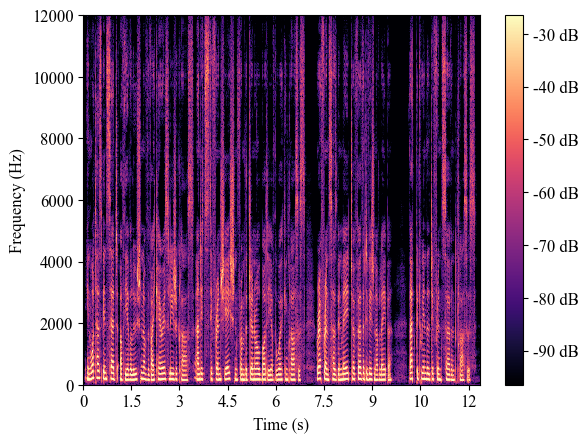
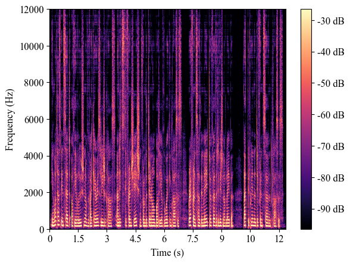
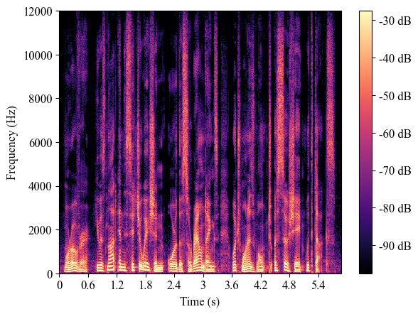
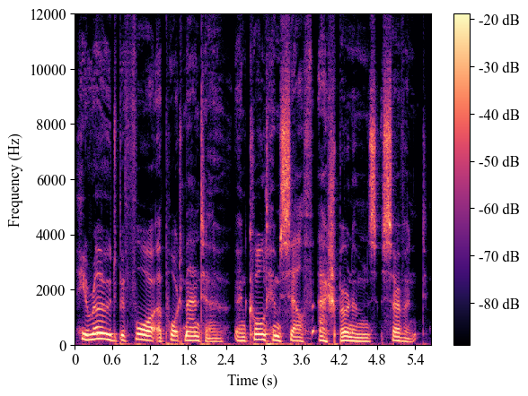

# BigVSAN: Enhancing GAN-based Neural Vocoders with Slicing Adversarial Network

Takashi Shibuya, Yuhta Takida, Yuki Mitsufuji 
Sony AI

[<a href="https://arxiv.org/abs/2309.02836">Paper</a>] [<a href="https://github.com/sony/bigvsan">Code</a>]

 

## Abstract
Generative adversarial network (GAN)-based vocoders have been intensively studied because they can synthesize high-fidelity audio waveforms faster than real-time. However, it has been reported that most GANs fail to obtain the optimal projection for discriminating between real and fake data in the feature space. In the literature, it has been demonstrated that slicing adversarial network (SAN), an improved GAN training framework that can find the optimal projection, is effective in the image generation task. In this paper, we investigate the effectiveness of SAN in the vocoding task. For this purpose, we propose a scheme to modify least-squares GAN, which most GAN-based vocoders adopt, so that their loss functions satisfy the requirements of SAN. Through our experiments, we demonstrate that SAN can improve the performance of GAN-based vocoders, including BigVGAN, with small modifications.

## Audio samples (<a href="https://www.isca-speech.org/archive/interspeech_2019/zen19_interspeech.html">LibriTTS</a> [1])

<table align="center"  style="text-align: center;">
  <thead>
    <tr>
      <th>Filename</th>
      <th style="text-align: center;">Ground truth</th>
      <th style="text-align: center;"><a href="https://openreview.net/forum?id=iTtGCMDEzS_">BigVGAN</a> [2] (our reproduction)</th>
      <th style="text-align: center;">BigVSAN (ours)</th>
      <th style="text-align: center;">BigVSAN w/ snakebeta</th>
    </tr>
  </thead>
  <tbody>
    <tr>
      <td style="text-align: center;">3570_5694_000004_000000 (test-clean)</td>
      <td style="text-align: center;"> 
            <audio controls="" style="width:250px;" preload="auto">
            <source src="media/ltclean1_gt.wav"></audio></td>
      <td style="text-align: center;"> 
            <audio controls="" style="width:250px;" preload="auto">
            <source src="media/ltclean1_bigvgan_reproduction.wav"></audio></td>
      <td style="text-align: center;"> 
            <audio controls="" style="width:250px;" preload="auto">
            <source src="media/ltclean1_bigvsan.wav"></audio></td>
      <td style="text-align: center;"> 
            <audio controls="" style="width:250px;" preload="auto">
            <source src="media/ltclean1_bigvsan_snakebeta.wav"></audio></td>
    </tr>
    <tr>
      <td style="text-align: center;">7176_88083_000002_000004 (test-clean)</td>
      <td style="text-align: center;"> 
            <audio controls="" style="width:250px;" preload="auto">
            <source src="media/ltclean2_gt.wav"></audio></td>
      <td style="text-align: center;"> 
            <audio controls="" style="width:250px;" preload="auto">
            <source src="media/ltclean2_bigvgan_reproduction.wav"></audio></td>
      <td style="text-align: center;"> 
            <audio controls="" style="width:250px;" preload="auto">
            <source src="media/ltclean2_bigvsan.wav"></audio></td>
      <td style="text-align: center;"> 
            <audio controls="" style="width:250px;" preload="auto">
            <source src="media/ltclean2_bigvsan_snakebeta.wav"></audio></td>
    </tr>
    <tr>
      <td style="text-align: center;">8224_274384_000000_000001 (test-clean)</td>
      <td style="text-align: center;"> 
            <audio controls="" style="width:250px;" preload="auto">
            <source src="media/ltclean3_gt.wav"></audio></td>
      <td style="text-align: center;"> 
            <audio controls="" style="width:250px;" preload="auto">
            <source src="media/ltclean3_bigvgan_reproduction.wav"></audio></td>
      <td style="text-align: center;"> 
            <audio controls="" style="width:250px;" preload="auto">
            <source src="media/ltclean3_bigvsan.wav"></audio></td>
      <td style="text-align: center;"> 
            <audio controls="" style="width:250px;" preload="auto">
            <source src="media/ltclean3_bigvsan_snakebeta.wav"></audio></td>
    </tr>
  </tbody>
</table>

 

## References
[1] H. Zen, V. Dang, R. Clark, Y. Zhang, R. J. Weiss, Y. Jia, Z. Chen, and Y. Wu, “LibriTTS: A Corpus Derived from LibriSpeech for Text-to-Speech,” in Proc. Interspeech, 2019.  
[2] S.-g. Lee, W. Ping, B. Ginsburg, B. Catanzaro, and S. Yoon, “BigVGAN: A Universal Neural Vocoder with Large-Scale Training,” in Proc. ICLR, 2023.  
